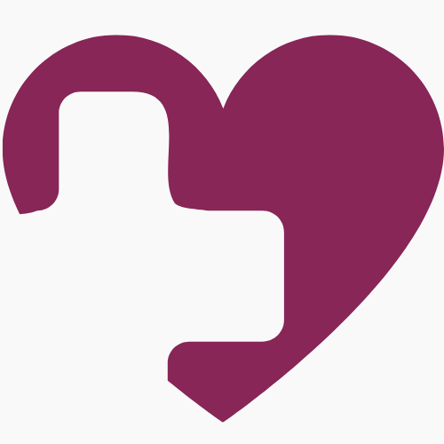

<!-- BADGES: Ali-Herrera & your-health-ally-2 -->

 
  

<!-- -->
<!--  -->

<!-- LINK TO TOP -->

<a name="readme-top"></a>

<!-- HEADER -->
<div align="center">
  <a href="https://example.com" target="_blank">
    
  </a>

  <h3 align="center">Your Health Ally</h3>

<p align="center">
    Everyone deserves to be heard.
    <br />
    <br />
      <!-- TODO: Replace link with deployed site -->
      <a href="https://www.youtube.com/watch?v=dQw4w9WgXcQ" target="_blank"> Deployed App (TBD) </a>
      🔭
      <a href="https://github.com/Ali-Herrera/your-health-ally-2" target="_blank"> GitHub Repository</a>
    <br />
    <br /> 
    <!-- TODO: Make demo? -->
    <a href="" target="_blank">View Demo (TBD) 🪟</a>
    ·
    <a href="https://github.com/Ali-Herrera/your-health-ally-2/issues" target="_blank">🪲 Report a Bug 🪲</a>
    ·
    <a href="https://github.com/Ali-Herrera/your-health-ally-2/issues" target="_blank">🦋 Request a Feature 🦋</a>
  </p>
</div>

<!-- TABLE OF CONTENTS -->
<details>
    <ol>
        <li>
            <a href="#about-the-project">About The Project</a>
            <ul>
                <li><a href="#description">Description</a></li>
                <li><a href="#features">Features</a></li>
                <li><a href="#stack-overview">Stack Overview</a>
                    <ul>
                        <li><a href="#prerequisites">Prerequisites</a></li>
                            <li><a href="#dependency-versions">Dependency Versions</a></li>
                        <li><a href="#installation">Installation</a></li>
                     </ul>
                </li>
                <li><a href="#branches">Branches</a></li>
                <li><a href="#dev-notes">Dev Notes</a></li>
            </ul>
        </li>
        <li><a href="#getting-started">Getting Started</a>
            <ul>
                <li><a href="#languages-and-runtimes">Languages and Runtimes</a></li>
                <li><a href="#frameworks-and-libraries">Frameworks and Libraries</a></li>
                <li><a href="#linters-and-formatters">Linters and Formatters</a></li>
                <li><a href="#apis-and-sdks">APIs and SDKs</a></li>
                <li><a href="#backing-services">Backing Services</a></li>
                <li><a href="#deployment-service">Deployment Service</a></li>
                <li><a href="#devops">DevOps</a></li>
            </ul>
        </li>
        <li><a href="#npm-scripts">NPM Scripts</a>
            <ul>
                <li><a href="#development">Development</a></li>
                <li><a href="#errors">Errors</a></li>
                <li><a href="#build">Build</a></li>
                <li><a href="#start">Start</a></li>
                <li><a href="#prisma">Prisma</a></li>
            </ul>
        </li>
        <li><a href="#usage">Usage</a></li>
        <li><a href="#contributors">Contributors</a></li>
        <li><a href="#license">License</a></li>
        <li><a href="#acknowledgments">Acknowledgments</a>
            <ul>
                <li><a href="#design-tools">Design Tools</a></li>
                <li><a href="#project-management-tools">Project Management Tools</a></li>
                <li><a href="#tutorials">Tutorials</a></li>
            </ul>
        </li>
  </ol>
</details>

<!-- CONTENTS -->

## About the Project

### Description

**Your Health Ally** is an app designed to transform the way our users approach and manage their health by:

- Empower users to advocate for their well-being
- Provide comprehensive information, resources, and tools, such as,
  - Types of doctors to see
  - Questions to bring to doctor
  - A checklist to prepare for office or virtual visits

A study in 2022 found that **52%** of individuals in the U.S. feel their symptoms are ignored, dismissed, or not believed when seeking medical treatment; **50%** of those respondents also reported that "a healthcare provider assume(ed) something about (them) without asking." [^1]

These statistics increase depending on the patient's race/ethnicity, sexual orientation (LGBTQIA+ community), gender identity (female, transgender and non-binary individuals), chronic health conditions, or disabilities. [^1]

Additionally, the Journal of General Internal Medicine found that on average, patients get **11 seconds** to explain the reason for their visit **before** they are interrupted by their doctors [^4]. This can lead to delays in proper diagnosis and treatment for patients.


[^2] [^3] [^7] [^7]

### Features

- Responsive design
- Intuitive navigation
- Authentication
- AI Chatbot
- Interactive Glossary
- Chat-to-PDF Conversion

### Stack Overview

#### Languages and Runtimes

[](https://www.typescriptlang.org/)
[](https://www.javascript.com/)
[](https://nodejs.org/en)

#### Frameworks and Libraries

[](https://v6.mantine.dev/)
[](https://nextjs.org/)
[](https://www.npmjs.com/)
[](https://reactjs.org/)

#### Linters and Formatters

[](https://eslint.org/docs/latest/)
[](https://prettier.io/)

#### APIs and SDKs

[](https://clerk.com/docs)
[](https://openai.com/)
[](https://trpc.io/)

#### Backing Services

[](https://www.mongodb.com/)
[](https://www.prisma.io/)

#### Deployment Service

[](https://vercel.com/)

#### DevOps

[](https://git-scm.com/doc)

### Dev Notes

**This is a [T3 Stack](https://create.t3.gg/) project bootstrapped with `create-t3-app`.**

- [Documentation](https://create.t3.gg/)
- [Tutorials](https://create.t3.gg/en/faq#what-learning-resources-are-currently-available)
- [GitHub Repository](https://github.com/t3-oss/create-t3-app)
- T3 Deployment Guides:
  - [Vercel](https://create.t3.gg/en/deployment/vercel)
  - [Netlify](https://create.t3.gg/en/deployment/netlify)
  - [Docker](https://create.t3.gg/en/deployment/docker) for more information.

**Mantine Imports**

1. Utilizing [Mantine v6.0.21](https://v6.mantine.dev/pages/basics/)

2. All `/hooks`, `/form` and `/core` components and their props, or any `React` hooks must be imported at the top of each file. Example below:

```
  import { useState } from 'react';
  import { useInputState, useMediaQuery } from '@mantine/hooks';
  import { useForm } from '@mantine/form';
  import { TextInput, NumberInput, Group, Text, ActionIcon } from '@mantine/core';
```

3. Import `Tabler` icons as you would import any icons in react.

```
import { IconBrandLinkedin } from "@tabler/icons-react";
```

<p align="right">(<a href="#readme-top"> 🔝 </a>)</p>

<!-- GETTING STARTED -->

## Getting Started

### Prerequisites

**1. Nodejs**

- Run `node -v` in the terminal to check if you already have `Node.js` installed.
- If it's installed, it will show the installed version.
- Follow Node.js [docs](https://nodejs.org/en/download/) to download.
- Once downloaded, run `node -v` command to double check it's installed.

**2. NPM**

- Run `npm -v` in the terminal to check if you already have `npm` installed.
- If it's installed, it will show the installed version.
- Follow npm [docs](https://docs.npmjs.com/about-npm) to create an account and to download.
- Once downloaded, run `npm -v` command to double check it's installed.
  - [Differences Between Yarn and NPM](https://www.knowledgehut.com/blog/web-development/yarn-vs-npm#differences-between-yarn-and-npm%C2%A0)

**3. MongoDB**

- Access to a `MongoDB 4.2+ server` with a replica set deployment.
  - `Prisma` recommends using `MongoDB Atlas`.
- The `MongoDB` database connector uses transactions to support nested writes.
  - Transactions require a replica set deployment.
  - The easiest way to deploy a replica set is with Atlas. It's free to get started.

### Dependency Versions

  
  
  
  
  
  
  

### Installation

**1. Clone repository to your local computer and open in a source code editor.**

**2. Download dependencies: `npm install` or `npm i`.**

**3. Double check you have a `.gitignore` file in the root folder.**

- _If there isn't a `.gitignore', follow these steps to make one:_

  - Run `touch .gitignore`.
  - Copy and paste the [GitHub/gitignore/Node.gitignore](https://github.com/github/gitignore/blob/main/Node.gitignore) template into your new `.gitignore` file
    - Make sure the following are included

```
# macOS
.DS_Store

# LinuxOS
.*.swp

# Windows
*.pyc

# Dependency directories
node_modules/
jspm_packages/

# TypeScript cache
*.tsbuildinfo

# dotenv environment variable files
.env
.env*
```

**4. Set up `Clerkjs` developer account for authentication.**

- Create an [account](https://clerk.com/docs/quickstarts/setup-clerk) with `Clerkjs`.
- Install `@clerk/nextjs` in the root folder: `npm install @clerk/nextjs`
- Set up your environment keys in `.env.local` in the root folder:

```
NEXT_PUBLIC_CLERK_PUBLISHABLE_KEY=​pk_test_example
CLERK_SECRET_KEY=​sk_test_example
```

- Refer to the Clerkjs [Quickstart Guide](https://clerk.com/docs/quickstarts/nextjs) with Nextjs for more information.

**5. Install Prisma: Run `npm install prisma --save-dev`**

- After installation, run `npm run postinstall`: It reads your Prisma schema and generates Prisma Client JS, a type-safe database client for your application.

**6. Configure MongoDB connection:**

- In your `.env` file, set up MongoDB connection string from MongoDB Atlas
- This establishes a connection with MongoDB cluster (DATABASE_URL).

**7. View Tables (collections) in Prisma Studio:**

- _After_ installing Prisma and configuring MongoDB connection string, you can use Prisma Studio to view the collections.
- Run `npm run db:studio`

<p align="right">(<a href="#readme-top"> 🔝 </a>)</p>

## NPM Scripts

### Development

- `npm run dev`: starts the dev server at `http://localhost:3000/`
- `npm run db:push`: updates the database schema to match the Prisma schema, without using migrations. It's mostly used in development.

### Errors

- `npm run lint`: runs ESLint to catch errors
  - code must pass ESLinst error check **before** build

### Build

- `npm run build`: generates an optimized version of the app for production

### Start

- `npm run start`: starts the app while in production mode
  - app must be compiled with `build` **before** `start`

### Prisma

- `npm run postinstall`: run after the package installation. It reads your Prisma schema and generates Prisma Client JS, a type-safe database client for your application.

- `npm run db:studio`: opens Prisma Studio, which is a visual interface for viewing and editing data in your database.

<p align="right">(<a href="#readme-top"> 🔝 </a>)</p>

## Usage

Use this space to show useful examples of how a project can be used. Additional screenshots, code examples and demos work well in this space. You may also link to more resources.

_For more examples, please refer to the [Documentation](https://example.com)_

<p align="right">(<a href="#readme-top"> 🔝 </a>)</p>

## Contributors

  
<a href="mailto:alisonherrera02@gmail.com"><strong>Contact Ali</strong></a>

[Portfolio](https://alisonherrera.com/) | [GitHub](https://github.com/Ali-Herrera) | [Medium](https://medium.com/@alisonherrera02)
<br />

  
<a href="mailto:vmcnorrill@gmail.com"><strong>Contact Victoria</strong></a>

[Portfolio](https://www.victoriamcodes.com/) | [GitHub](https://github.com/victoriamcn) | [Medium](https://medium.com/@vmcnorrill)

<p align="right">(<a href="#readme-top"> 🔝 </a>)</p>

## License


- <a href="https://github.com/Ali-Herrera/your-health-ally/blob/main/LICENCE" target="_blank"> Read more. </a>

<p align="right">(<a href="#readme-top"> 🔝 </a>)</p>

## Acknowledgements

#### Design Tools

[Canva](https://canva.com)  
[Excalidraw](https://excalidraw.com/)  
[Milanote](https://www.milanote.com/refer/rcEpkqyVyNt7y3JS1C)

#### Project Management Tools

[ClickUp](https://clickup.com)  
[Slack](https:/slack.com/)

#### Tutorials

[Best README](https://github.com/othneildrew/Best-README-Template/blob/master/README.md#roadmap)  
[Emojipedia](https://emojipedia.org/)  
[Img Shields](https://shields.io)  
[GitHub Emoji Cheat Sheet](https://www.webpagefx.com/tools/emoji-cheat-sheet)  
[Markdown Cheat Sheet](https://www.markdownguide.org/cheat-sheet/)  
[Nextjs 14 Custom Chatbot](https://www.youtube.com/watch?v=mkJbEP5GeRA)

<p align="right">(<a href="#readme-top"> 🔝 </a>)</p>

<!-- SOURCE CITATIONS -->

[^1]: Harris poll: Many patients feel ignored or doubted when seeking medical treatment . MITRE. (2022, December 20). https://www.mitre.org/news-insights/news-release/mitre-harris-poll-many-patients-feel-ignored-or-doubted#:~:text=MCLEAN%2C%20Va.%2C%20%26%20BEDFORD,believed%E2%80%9D%20when%20seeking%20medical%20treatment
[^2]: Ibrahim, A. (2021, September 1). Signs of ms may start five years before diagnosis. MS International Federation. https://www.msif.org/news/2018/08/26/signs-of-ms-may-start-five-years-before-diagnosis/
[^3]: Lupus facts and statistics. Lupus Foundation of America. (n.d.). https://www.lupus.org/resources/lupus-facts-and-statistics#:~:text=Lupus%20symptoms%20can%20also%20be,first%20notice%20their%20lupus%20symptoms.
[^4]: Singh Ospina, N., Phillips, K.A., Rodriguez-Gutierrez, R. et al. Eliciting the Patient’s Agenda- Secondary Analysis of Recorded Clinical Encounters. J GEN INTERN MED 34, 36–40 (2019). https://doi.org/10.1007/s11606-018-4540-5
[^5]: Ten early signs. Parkinson’s Foundation. (n.d.). https://www.parkinson.org/understanding-parkinsons/10-early-signs
[^6]: Twenty things you might not know about celiac disease. Celiac Disease Foundation. (2022, August 24). https://celiac.org/about-the-foundation/featured-news/2016/08/20-things-you-might-not-know-about-celiac-disease/#:~:text=There%20is%20an%20average%20delay,miscarriage%2C%20epilepsy%2C%20and%20more.
[^7]: Yale Medicine. (2024, January 19). Endometriosis. Yale Medicine. https://www.yalemedicine.org/conditions/endometriosis#:~:text=On%20average%2C%20women%20in%20the,are%20found%20to%20
